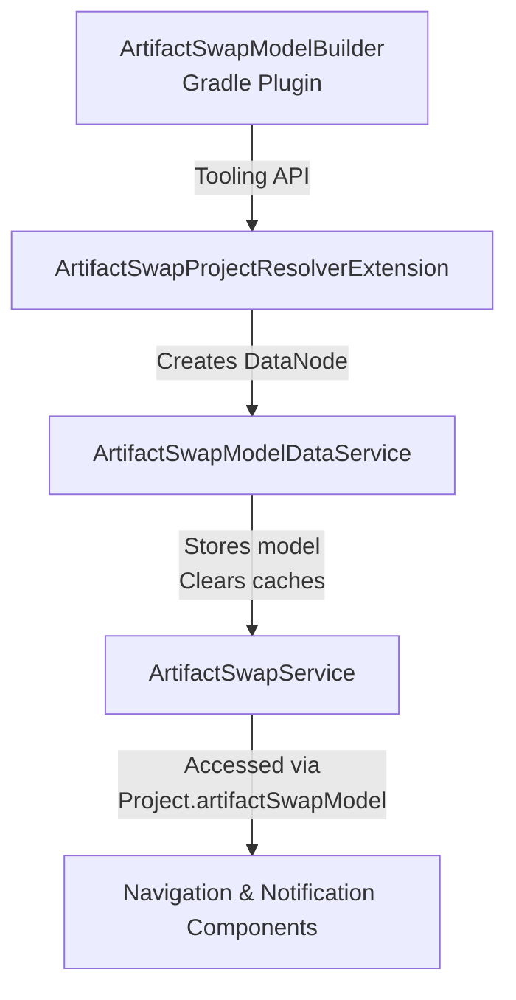
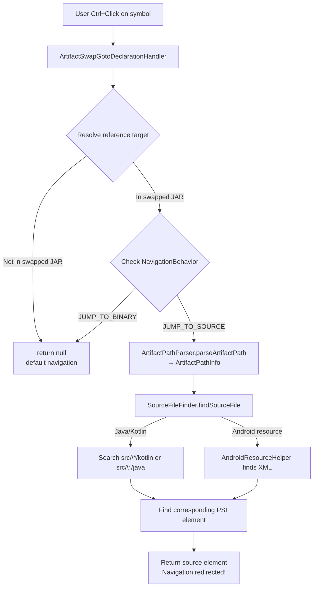
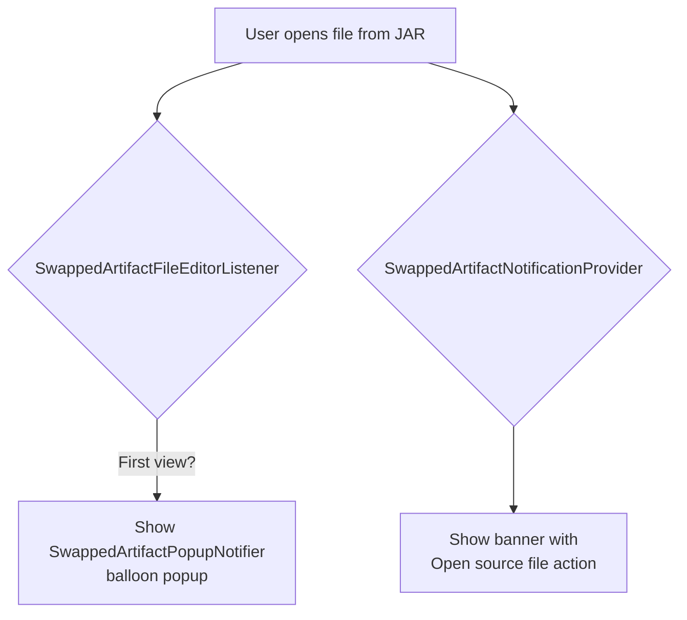

# Artifact Swap IDE Plugin

IntelliJ IDEA plugin that intercepts navigation to classes in swapped artifacts and redirects to source files in the local project.

## Gradle Sync Integration

The plugin receives configuration from the Gradle plugin during project sync via the Gradle Tooling API.

### Components

**`ArtifactSwapProjectResolverExtension`**
- Requests `ArtifactSwapModel` from Gradle during sync via Tooling API
- Model built by `ArtifactSwapModelBuilder` in the Gradle plugin
- Provides: Maven group ID, BOM version

**`ArtifactSwapModelDataService`**
- Receives `ArtifactSwapModel` after Gradle sync completes
- Stores model in `ArtifactSwapService`
- Clears navigation caches to prevent stale mappings

**`ArtifactSwapService`**
- Project-scoped service holding current `ArtifactSwapModel`
- Authoritative source of config post-sync
- Accessed via `Project.artifactSwapModel` extension property

**Path Parsing** (`:core` module)
- `ArtifactPathParser`: General Gradle path parsing logic (no IDE dependencies)
- `ArtifactSwapModelExtensions`: Extension methods on `ArtifactSwapModel` for path operations
- Detects swapped artifacts in Maven Local and Gradle transform cache
- Parses artifact paths into `ArtifactPathInfo` (artifact ID → project path → module directory)

### Dataflow

## Editor Navigation Assistance

### Go To Definition

Intercepts `Ctrl+Click` / `Cmd+Click` navigation events to redirect from binary artifacts to source files.

#### Components

**`ArtifactSwapGotoDeclarationHandler`**
- Registered with `order="first"` to intercept before default handlers
- Checks if target is inside swapped artifact JAR
- Redirects to source file using `SourceFileFinder`
- Handles Java/Kotlin classes (via PSI matching) and Android resources (via XML parsing)
- Respects user's `NavigationBehavior` setting

**`SourceFileFinder`**
- Locates source files by mapping artifact ID → Gradle project path → module directory → source file
- Uses `ArtifactPathParser` (from `:core`) for path parsing
- Searches `src/main/*` first, then other source sets
- Handles Kotlin multi-class files by parsing PSI and matching class names

**Android Support**
- `AndroidPluginSupport`: Handle interacting with IDE elements from the Android Plugin, which may not be installed
- `AndroidResourceHelper`: Finds XML and other resources by type, parses to locate specific definitions
- `ArtifactSwapMavenLocalHelper`: Parses BOM to extract artifact versions, reads Android namespace from AAR manifests

**Utilities**
- `PsiUtils`: PSI traversal helpers for matching symbols across binary/source, resolves multi-reference elements

#### Dataflow

### Source JAR Navigation

Provides fallback UI when users view decompiled code from swapped artifacts (e.g., via Find Usages or stack traces).

#### Components

**`SwappedArtifactNotificationProvider`**
- Shows editor banner when viewing decompiled code from swapped artifact
- Provides "Open source file" action button

**`SwappedArtifactFileEditorListener`**
- Listens for file open events
- Shows balloon popup suggesting source navigation on first view
- One-time prompt that can be dismissed

**`SwappedArtifactPopupNotifier`**
- Displays popup balloon notifications
- Offers "Jump to Source" and settings configuration actions

**Settings**
- `ArtifactSwapSettings`: Persists `NavigationBehavior` preference (`JUMP_TO_BINARY` default or `JUMP_TO_SOURCE`)
- `ArtifactSwapSettingsConfigurable`: Settings UI under Tools → Artifact Swap

#### Dataflow

